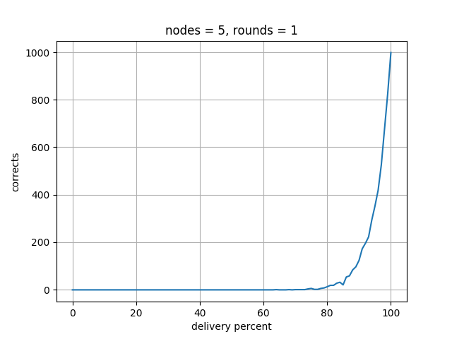
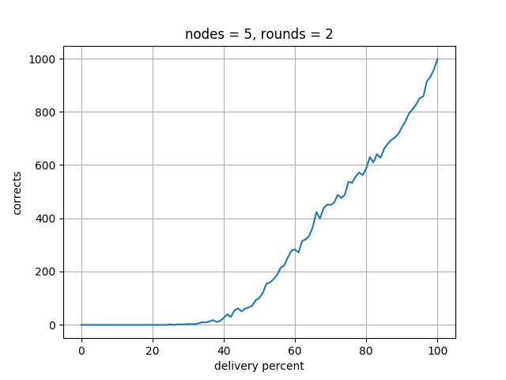
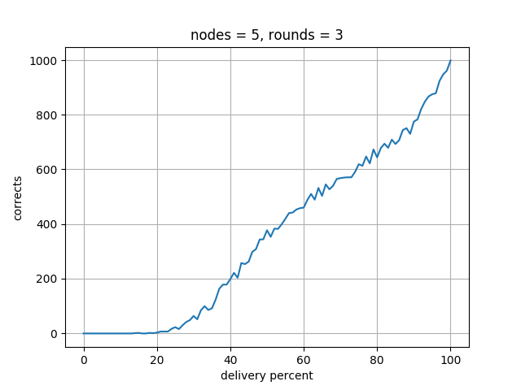
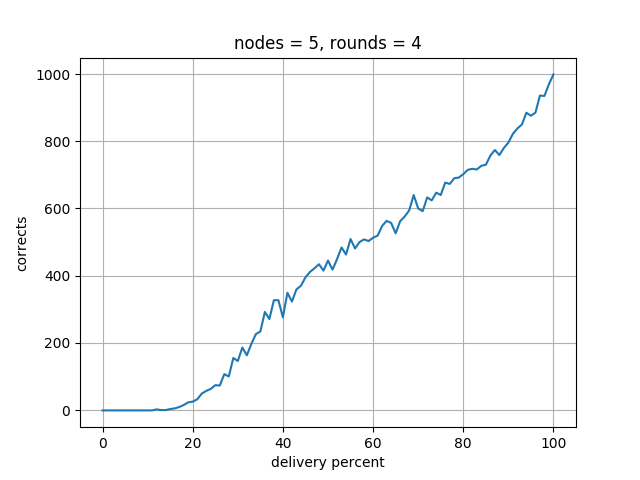
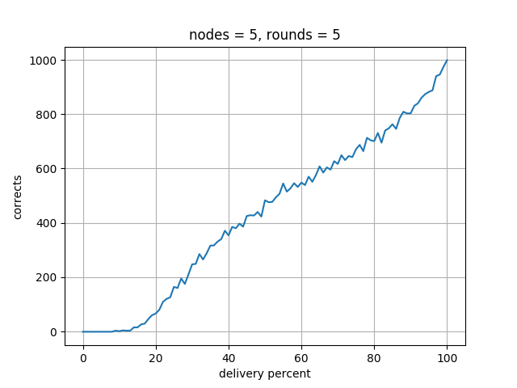

# Coordinated Attack

A simple program that simulates Coordinated Attack algorithm. It supposes that all of the nodes(=n) start with value 1.

The code simulates the algorithm with `r` Rounds and for Messegae Delivery Percentage of [0, 100], to show how Network Availibility can affect the final result to be on 1 (assuming that all of them have started with value 1).

- *Because of some optimizations put in the code to make it faster with high number of simulation iterations, the code might seem a little different than the starightforward implementation.*

### Some plots generated by the code for nodes=5, rounds=5, simulation times=1000 :

*Please note that this is only a simple simulation, might even with bugs in the implementation!*
